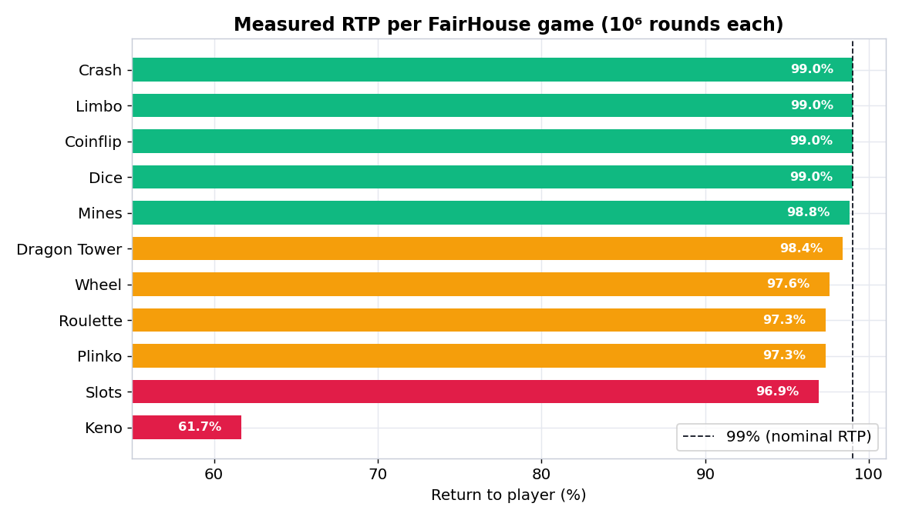
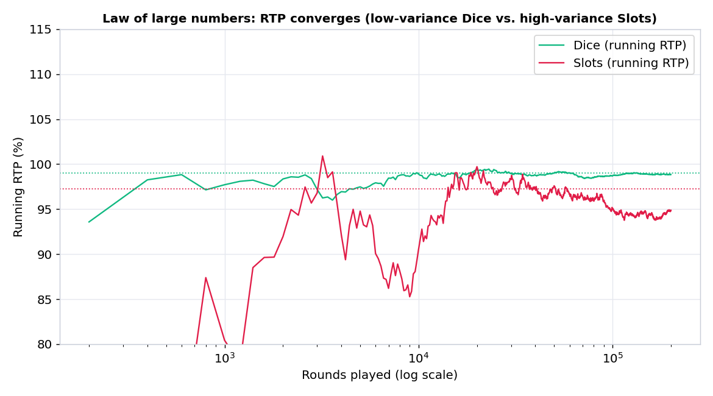
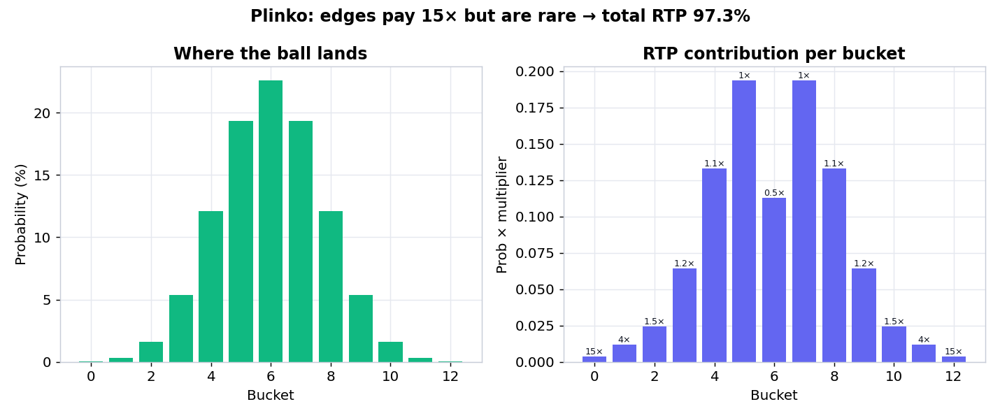

# FairHouse - Game Math & Fairness Lab 🎲🐍

A Python companion to [FairHouse](../README.md), a provably-fair crypto-casino
built in TypeScript. The lab does two things, using FairHouse's exact game rules
ported to Python and verified to match the TypeScript byte-for-byte:

1. **Verify fairness.** Reproduce the outcome of any real bet from its
   `server_seed`, `client_seed`, and `nonce`, so you can prove nothing was
   tampered with.
2. **Measure the math.** Monte-Carlo simulate millions of rounds of every game to
   get the true RTP (return-to-player), house edge, volatility, and hit
   frequency.

Why bother: shipping a casino game means proving two things to a regulator. That
outcomes are fair (reproducible from a public commitment), and that the house
edge is what you claim. This lab is the QA tool for both. It's the analytical
half of FairHouse, written in the language that half usually is: Python.

## What it found

Running 10^6 rounds per game against the live provably-fair pipeline:



| Game | Representative bet | Measured RTP | House edge | Closed-form theory |
|------|--------------------|-------------:|-----------:|-------------------:|
| Dice | roll under 50 | 98.98% | 1.02% | 99.00% |
| Coinflip | bet heads | 98.98% | 1.02% | 99.00% |
| Limbo | cash out at 2.00x | 99.03% | 0.97% | 99.00% |
| Crash | auto-cash at 2.00x | 99.03% | 0.97% | 99.00% |
| Mines | 3 mines, reveal 3 | 98.81% | 1.19% | 99.00% |
| Dragon Tower | medium, climb 3 | 98.39% | 1.61% | 99.00% |
| Wheel | single spin | 97.48% | 2.52% | 97.50% |
| Roulette | bet red | 97.25% | 2.75% | 97.30% |
| Plinko | 12 rows | 97.33% | 2.67% | 97.34% |
| Slots | 3 reels | 96.81% | 3.19% | 97.22% |
| **Keno** | **8 spots** | **61.80%** | **38.20%** | **61.78%** |

A few things worth calling out:
- The instant games (Dice, Coinflip, Limbo, Crash, Mines, Tower) hit their
  intended 1% edge almost exactly.
- The fixed-paytable games (Wheel, Roulette, Plinko, Slots) can't. Their discrete
  payouts land the edge at 2.5-3% no matter what. The sim matches the closed-form
  value inside the confidence interval, which confirms the port is faithful.
- Keno's 8-spot paytable is brutal: a 38% house edge. That's the kind of outlier
  a game-math QA pass is meant to catch before launch.

Two more views. The law of large numbers (low-variance Dice vs high-variance
Slots), and why Plinko's 15x edges don't rescue its RTP:




## The fairness guarantee (parity)

The Python isn't a re-implementation that should match, it's checked. The
`tools/gen_reference.ts` script runs the real FairHouse TypeScript and dumps
outcomes to `tests/reference.json`. Then `tests/test_parity.py` asserts the
Python reproduces every one, including the order-sensitive hash-shuffle deals
(Mines, Dragon Tower, Keno, and the 52-card deck).

```bash
npx tsx math-lab/tools/gen_reference.ts > math-lab/tests/reference.json  # from repo root
```

## Run it

```bash
cd math-lab
python3 -m venv .venv && source .venv/bin/activate
pip install -r requirements.txt

pytest                        # 26 tests: parity + simulator + API
python report.py              # print the RTP / house-edge table
python report.py --base 4000000   # more rounds, tighter confidence intervals
python reports/charts.py      # regenerate the charts
uvicorn api.main:app --reload # the verifier + live-RTP API on :8000
```

Verify a bet through the API:

```bash
curl -X POST localhost:8000/verify \
  -H 'content-type: application/json' \
  -d '{"server_seed":"...","client_seed":"...","nonce":0}'
```

## Layout

```
math-lab/
├── fairhouse/
│   ├── provably_fair.py   # HMAC-SHA256 commitment core (port of provablyFair.ts)
│   ├── games.py           # every game's outcome math (port of games.ts)
│   └── simulate.py        # Monte-Carlo engine + closed-form RTP
├── api/main.py            # FastAPI: /verify, /simulate, /rtp
├── reports/charts.py      # matplotlib charts for this README
├── tools/gen_reference.ts # runs the real TS to build the parity fixture
├── tests/                 # parity, simulator, and API tests
└── report.py              # CLI RTP report
```

## Tech

Python 3, FastAPI, pytest, matplotlib, Monte-Carlo simulation, HMAC-SHA256.
Shares its game math with the TypeScript FairHouse casino by construction.
